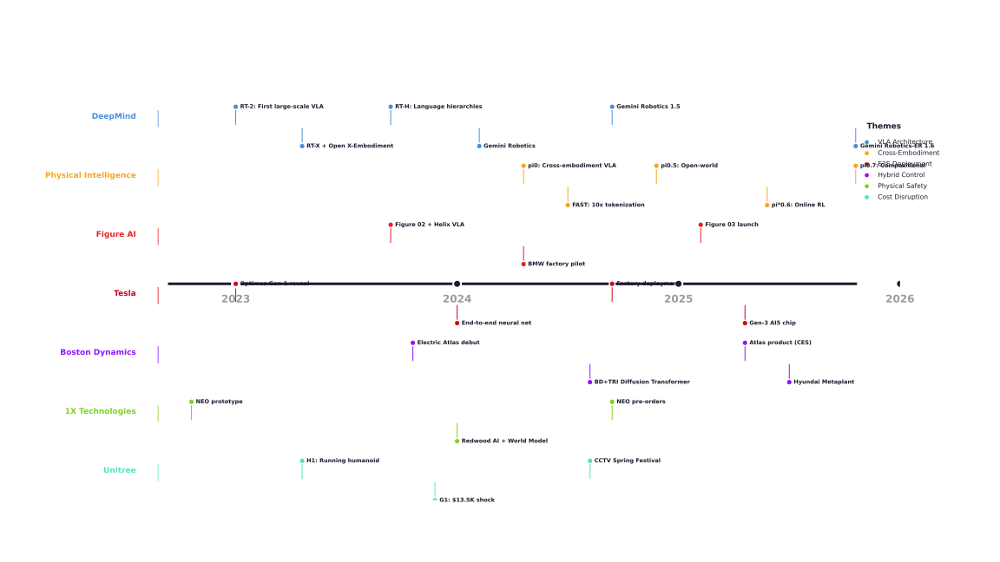
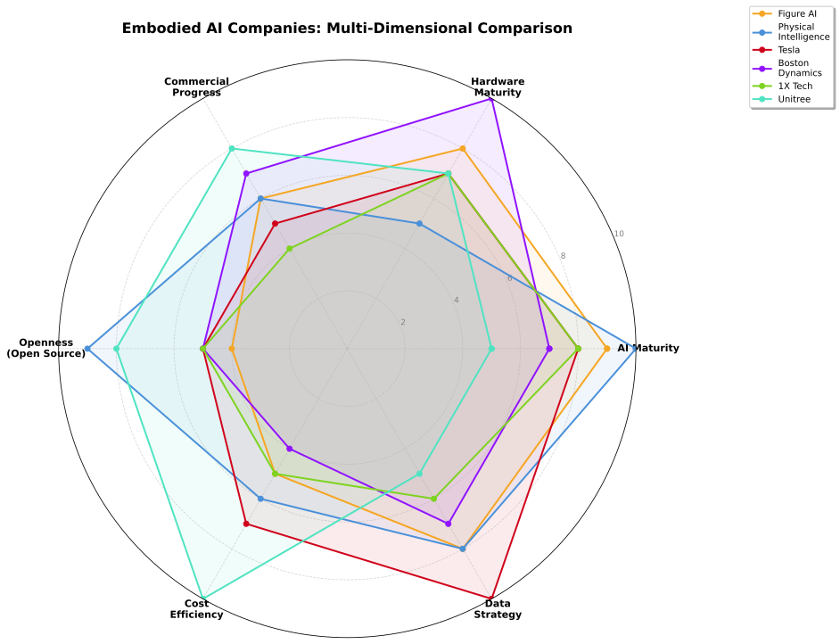
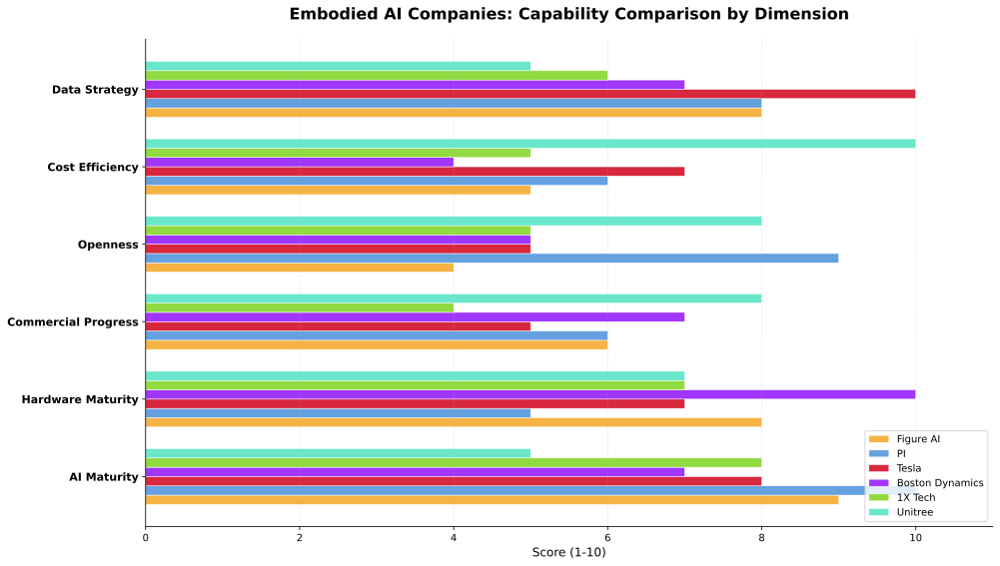
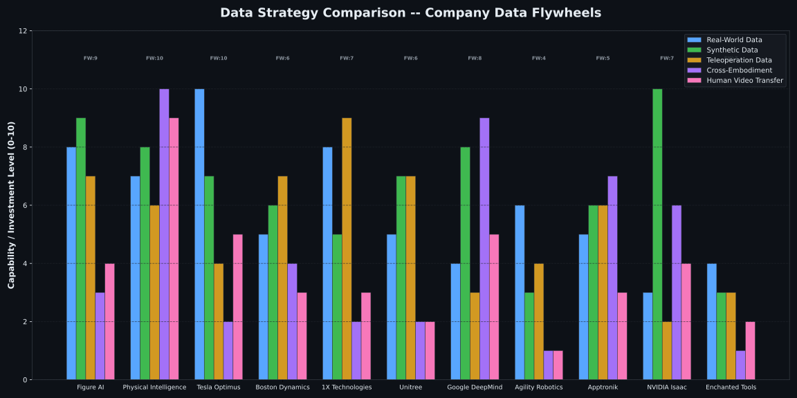

<!-- SEO -->
<meta name="keywords" content="人形机器人,具身智能,Embodied AI,VLA,Flow Matching,Figure AI,Physical Intelligence,Tesla Optimus,Boston Dynamics,Unitree,数据飞轮,Sim2Real,机器人算法,人形机器人公司">
<meta name="author" content="wikieden">
<meta name="robots" content="index, follow">

<!-- Open Graph -->
<meta property="og:title" content="Soul2Humanoid — 具身大脑技术方案调研">
<meta property="og:description" content="系统性调研全球主流机器人公司（Figure AI、Physical Intelligence、Tesla Optimus、Boston Dynamics、Unitree、1X 等）的具身智能技术路线，聚焦 VLA 端到端、Flow Matching、数据飞轮等核心算法架构。">
<meta property="og:type" content="website">
<meta property="og:url" content="https://wikieden.github.io/Soul2Humanoid/">
<meta property="og:image" content="https://wikieden.github.io/Soul2Humanoid/assets/og-image.png">
<meta property="og:locale" content="zh_CN">
<meta property="og:site_name" content="Soul2Humanoid">

<!-- Twitter Card -->
<meta name="twitter:card" content="summary_large_image">
<meta name="twitter:title" content="Soul2Humanoid — 具身大脑技术方案调研">
<meta name="twitter:description" content="系统性调研全球主流机器人公司的具身智能技术路线，聚焦 VLA、Flow Matching、数据飞轮等核心算法架构。">
<meta name="twitter:image" content="https://wikieden.github.io/Soul2Humanoid/assets/og-image.png">

# Soul2Humanoid — 具身大脑技术方案调研

> 系统性调研全球主流机器人公司的具身智能（Embodied AI）技术路线，聚焦「大脑」层面的算法架构、模型演进与工程实践。

[](https://github.com/wikieden/Soul2Humanoid/actions/workflows/check-links.yml)
[](./)
[](./reports)
[](./papers.md)
[](https://github.com/wikieden/Soul2Humanoid)
[](mailto:wikieden@gmail.com)

---

## 目录

- [最新动态](#最新动态)
- [项目简介](#项目简介)
- [调研覆盖公司](#调研覆盖公司)
- [横向对比概览](#横向对比概览)
- [目录结构](#目录结构)
- [参考资源](#参考资源)
- [技术关键词索引](#技术关键词索引)
- [使用方式](#使用方式)
- [贡献与更新](#贡献与更新)

---

## 最新动态

> 每次更新记录于此，详细动态见 [`latest-news.md`](./latest-news.md)

### 2026-08-16

| 公司/事件 | 重大动态 |
|----------|---------|
| **宇树科技 (Unitree)** | 科创板 IPO 配售结果：发行价 150.8 元、发行市值约 610 亿、发行 PE 219 倍；网下超 5000 倍（多家媒体称 8000 倍）、95 家公募 5,117 只产品获配合计 **18.2 亿元**；累计双足人形产能 1.8 万台；挂牌预计 8 月下旬 |
| **DeepSeek × 宇树** | DeepSeek **1.41 亿元**参与 IPO 战略配售（36 个月最长锁定期）+ 签《战略合作备忘录》：联合研发 AGI、**互为优先采购**（本体 ↔ 模型/算力） |
| **LG × NVIDIA** | MOU 落地：基于 **Isaac GR00T + Jetson Thor** 开发新一代双足人形（2027 Q1 发布）；CLOiD 轮式进美国工厂产线、AI 工厂参考站点 |
| **国资委** | WRC（8/19–23）前瞻：大会期间揭牌「**中央企业机器人创新联合体**」，央企巡检/核岛/战略采购（5,000 台）实景落地 |
| **WRC / 人形运动会** | WRC 2026 前瞻（300+ 企业）；第二届世界人形机器人运动会 8/22–26 冰丝带（666 支队伍 / 2,056 台机器人、30 竞技赛 + 21 场景赛） |
| **资本与出货量** | 央视财经：H1 国内具身智能融资 **935 亿元（同比 5 倍）**；SAG：H1 全球出货 1.91 万台（**+272%**）、前五全中国企业、**智元登顶全球**、智元+宇树占 70%+ |
| **Dyna Robotics** | 发布 **Dyna-2**：100 万小时人类视频世界动作模型，人→机迁移 scaling law，挑战 VLA 主流地位 |
| **Figure AI / Foundation** | 灵巧手路线之争：Adcock「**肌腱驱动是局部最优解**」炮打直接驱动阵营 |
| **San Mateo County** | 美国首个商用机器人地方条例：持证 + kill switch + 消防计划 + 就业影响跟踪，遥操作模式承压 |
| **家庭服务机器人（赛道调研）** | 未来不远 **Pre-A 近 10 亿元**（字节 / 汇川产投 / 纳爱斯，500 真实家庭 / 5 万小时数据、Self-Evolving WAM）；乐享「元点」**M1 定价 7,000–9,000 元、3 万台订单** + Jupiter/N1 发布；优必选 **U1 预售 1.3 万台**（11.98 万–99 万元，9/16 交付）；越疆 **LUMO**「具身全栖」发布；`comparisons.md` 新增「十、家庭服务机器人赛道对比」 |
| **WAM 落地全景（深度调研）** | 新增 [`wam-landscape.md`](./wam-landscape.md)：WAM 概念溯源（Jim Fan / NVIDIA 8/4 官方解读）、已上真机部署（越疆空弈 99.25% / 未来不远 500 家庭 / 极智嘉 Gravity 4D 仓储）、模型级发布（生数 Motubrain 双榜第一 / Dyna-2 / Cosmos 3）、学术线（AHA-WAM 56.95Hz）；核验源：生数官网 / 新华网 / NVIDIA Blog / arXiv |

**行业趋势**：宇树上市建立本体估值锚（610 亿发行市值、219 倍 PE）·「模型+本体」深度绑定（DeepSeek×宇树 36 个月互锁）·NVIDIA GR00T 生态再拓 LG·WRC + 人形运动会北京双会连环·数据/产能进入「实干检验期」（935 亿融资投向交付能力）

### 2026-07-30

| 公司/事件 | 重大动态 |
|----------|---------|
| **Google DeepMind** | 发布 **Gemini Robotics 2**：全身控制（脚到指尖）+ 五指灵巧手（22-DoF）+ 多机器人协作；ER 2 通过 Gemini API 公开 |
| **FCC** | 将外国产人形机器人列入国家安全禁止清单（中国占 85% 市场） |
| **Robros（韩国）** | IGRIS-C 后空翻，全栈自研硬件+软件+AI |
| **智在无界** | Being-H0.8 隐式触觉世界模型（50万小时数据） |
| **北京人形创新中心** | TG-VLA 全身模型 + 100 万小时训练基地目标 |
| **新华网** | 量产元年纪实：G2 工厂 2283次零失误，节拍提升 33% |
| **Anthropic-PI** | 确认春天收购谈判但未成交，OpenAI 持股成最大障碍 |

**行业趋势**：全身 VLA 模型突破（Gemini Robotics 2）·开源/闭源路线分化·FCC 禁令重塑全球竞争格局·触觉+世界模型成新赛道

### 2026-07-17

| 公司/事件 | 重大动态 |
|----------|---------|
| **WAIC 2026** | 上海开幕（10万㎡、1,100+企业、300+首发），具身智能成最大亮点 |
| **Robbyant (蚂蚁)** | 开源 LingBot-VLA 2.0（60K小时、20形态）；发布 LingBot-VA 2.0 原生世界模型 |
| **NVIDIA** | 开源 GR00T 1.7（Apache 2.0，40K小时训练数据，通用人形基础模型） |
| **小米** | 发布 Robotics-U0（380亿参数多模态基础模型） |
| **小鹏 (XPENG)** | Iron 人形月产千台目标，2027 全球发售 |
| **普渡机器人** | WAIC 发布 Physical Agent 架构 + PUDU D7 半人形首展 |
| **腾讯** | Robotics X Lab「小六」WAIC 首秀 |
| **1X** | NEO Hands 25-DoF 肌腱驱动灵巧手发布 |

**行业趋势**：VLA 模型开源潮加速（NVIDIA + Robbyant）·WAIC 具身智能崛起·量产竞赛全面开启·世界模型路线分化

### 2026-07-05

| 公司/事件 | 重大动态 |
|----------|---------|
| **AI2 Robotics** | 完成近 **7.35 亿美元**融资，投后估值约 200 亿元，轮式人形机器人 AlphaBot |
| **新华财经** | 全球具身智能产业迈入量产交付关键窗口期，头部企业加速规模化生产 |
| **两协会倡议** | 中国人形机器人百人会 + 中国机械工业联合会发布情感陪伴人形机器人发展倡议 |
| **亚布力论坛** | 具身智能商业化热议：无界动力获近 1 亿美元订单，宇树陈立判断 2-5 年突破 |
| **Tesla Optimus** | 弗里蒙特工厂首条量产产线落地，7 月底启动小批量量产（周产 100 台），9 月冲刺周产 1,000 台 |

**行业趋势**：量产交付关键窗口期开启·资本持续涌入（AI2 7.35 亿美元）·情感陪伴机器人规范化·Optimus 量产倒计时

### 2026-07-04

### 2026-06-26

### 2026-06-19

| 公司 | 重大动态 |
|------|---------|
| **傅利叶 (Fourier)** | GR-3 千万级订单落地东南亚最大康复中心（马来西亚 PERKESO）；「产品出海→生态出海」三年规划 |
| **宇树科技 (Unitree)** | IPO 招股书披露：2025 营收 17 亿、净利 6 亿、85% 募投研发；7.5 万/年人形 + 11.5 万/年四足产能规划 |
| **Figure AI** | Figure 02 在 BMW Spartanburg 工厂达成新运营里程碑，从试点转向有限生产集成 |
| **1X Technologies** | 启动 NEO Beta Household Trial Programme，3 个月全球筛选家庭测试 |
| **Agility Robotics** | Digit 扩展至 Amazon 多个美国配送中心，承载 20 kg |
| **智元 (AGIBOT)** | VivaTech 2026 Paris 展示「三智合一」架构 + G2/D1/X2 机器人游行 |
| **Foxconn** | VivaTech 欧洲首秀，NVIDIA Isaac GR00T 闭环物理 AI 栈，轮式人形做精密装配 |
| **Genesis AI** | 发布 Eno 通用机器人（非人形路线），Eric Schmidt 投资，GENE 基础模型 |
| **Faraday Future** | 全形态 EAI Robot World 6 系列；All-New Futurist 人形；FX Navi 四足 $1,990 |
| **Seres 赛力斯** | 发布首款人形机器人 Xiaosai，用于车辆检测与生产 |
| **Alibaba** | 发布 Qwen-Robot 系列：Manip (VLA) + Nav (VLN) + World 三个模型，开源数据训练 |
| **Automate 2026** | Kawasaki 8 轴 RL030N、Autonomique 实产、Curr-0、MINT-4B VLA、Sanctuary AI 99.5% 成功率 |
| **中国人形「六小龙」** | 宇树/云深处/乐聚/智元/傅利叶/星动 集体冲刺 IPO；2026 年 20+ 家明确上市计划 |

**行业趋势**：IPO 窗口期·车企集体入局（Seres+BYD+FF）·非人形路线分歧（Genesis Eno）·中国六小龙资本化·VLA 全栈化（Alibaba Qwen-Robot）

### 2026-06-16

| 公司 | 重大动态 |
|------|---------|
| **Figure AI** | BotQ 1 台/小时，350+ F03 交付；与 **Catalyst Brands** 签署物流部署协议；BMW Leipzig 工厂部署确认；参与组装 **3 万台** BMW SUV |
| **1X Technologies** | 成立 **World Model Lab**，Luma AI 研究员加盟；NEO Factory 量产，$499/月订阅；**10K→100K/年**产能路线 |
| **智元 (AGIBOT)** | 远征 A3 **全球首个**全尺寸人形机器人自主打乒乓；**10,000 台**量产里程碑；BFM-2 运动基座模型 |
| **星动纪元 (StarDynamics)** | **10 亿元** A+ 轮融资（吉利资本领投）；物流场景 100+ 台部署；5 亿商业化订单 |
| **BYD** | 正式确认人形机器人项目「尧舜禹」，**2 万台**年底部署，自建年产能 5 万台 |
| **Tesla** | Giga Texas Optimus 工厂动工；Fremont Model S 产线改为 Optimus 产线；Gen 3 年中发布 |
| **NVIDIA** | Isaac **GR00T** 开源人形机器人参考设计（Unitree H2+Jetson Thor） |
| **Physical Intelligence** | **π0.7** 发布：7B 参数涌现能力，零样本未见任务泛化 |
| **NEURA Robotics** | **$1.4B** 融资，行业最大单笔投资之一 |

**行业趋势**：量产竞赛·垂直整合·中国公司全面崛起（智元+星动+BYD）·开源平台加速（NVIDIA GR00T）·从 Demo 到商业合同

### 2026-04-29

| 动态 | 详情 |
|------|------|
| 新增 4 家公司报告 | Agility Robotics、Apptronik、NVIDIA Isaac、Enchanted Tools |
| 技术标签系统 | [`tags.md`](./tags.md) — 8 大维度，多标签交叉检索 |
| 中文媒体资源 | [`podcasts-videos.md`](./podcasts-videos.md) — 播客/B站/YouTube/会议 |
| 数据策略对比图 | 11 公司 5 维度柱状图 + 4 种飞轮模式图 |
| Twitter/X 监控 | [`people.md`](./people.md) — 12 个公司号 + 10 位关键人物 |

---

## 项目简介

本项目旨在追踪和梳理**人形机器人/具身智能领域**中，头部公司的技术方案与产品演进。核心关注维度包括：

- **感知架构**：视觉-语言-动作（VLA）融合、多模态输入处理
- **决策大脑**：端到端神经网络、任务规划、长程推理
- **动作生成**：Flow Matching / Diffusion、动作 Tokenization、高频控制
- **数据飞轮**：仿真到真实（Sim2Real）、人类视频迁移、自主数据生成
- **硬件协同**：AI-First 硬件设计、执行器与传感器选型

---

## 调研覆盖公司

| 公司 | 核心产品 | 技术路线关键词 | 报告 |
|------|---------|--------------|------|
| **Figure AI** | Figure 03 + Helix VLA | 人形通用机器人、VLA 端到端、BotQ 数据飞轮 | [`reports/figure-ai/`](./reports/figure-ai/) |
| **Physical Intelligence (π)** | π0.7 通用策略 | 跨本体 VLA 基础模型、Flow Matching、可组合泛化 | [`reports/physical-intelligence/`](./reports/physical-intelligence/) |
| **Tesla** | Optimus 人形机器人 | FSD 技术迁移、端到端神经网络、大规模数据闭环 | [`reports/tesla-optimus/`](./reports/tesla-optimus/) |
| **Boston Dynamics** | Atlas 电动版 | MPC+RL 混合控制、Hyundai 供应链、工业级可靠性 | [`reports/boston-dynamics/`](./reports/boston-dynamics/) |
| **1X Technologies** | NEO 家用机器人 | 肌腱驱动、World Model、Redwood VLA、OpenAI 合作 | [`reports/1x-technologies/`](./reports/1x-technologies/) |
| **Unitree 宇树科技** | H1/G1 人形机器人 | 极致性价比、开源生态、RL+模仿学习 | [`reports/unitree/`](./reports/unitree/) |
| **Google DeepMind** | Gemini Robotics / RT 系列 | VLA 奠基者、Open X-Embodiment、跨本体泛化 | [`reports/google-deepmind/`](./reports/google-deepmind/) |
| **Agility Robotics** | Digit 仓库机器人 | 仓储物流专用、传统控制、RaaS 商业模式 | [`reports/agility-robotics/`](./reports/agility-robotics/) |
| **Apptronik** | Apollo 通用人形 | 模块化硬件、NASA 执行器、Google Gemini 合作 | [`reports/apptronik/`](./reports/apptronik/) |
| **NVIDIA Isaac** | GR00T / Jetson / Isaac Sim | 具身智能基础设施、仿真平台、卖铲人 | [`reports/nvidia-isaac/`](./reports/nvidia-isaac/) |
| **Enchanted Tools** | Miroki 服务机器人 | 社交/康养场景、Pepper 团队、轮式服务 | [`reports/enchanted-tools/`](./reports/enchanted-tools/) |
| **Genesis AI** | GENE-26.5 全栈人形 | Human-Level 宣称、Wuji Tech 硬件合作、新兴公司 | [`reports/genesis-ai/`](./reports/genesis-ai/) ⚠️信息有限 |
| **智元 (AGIBOT)** | 远征 A3 人形机器人 | 端到端 VLA（GO-2）、世界模型 GE-2、BFM-2 运动基座、AIMA 生态、10K+ 量产 | [`reports/agibot/`](./reports/agibot/) |
| **星动纪元 (StarDynamics)** | 星动 L7 人形机器人 | ERA-42 VLA 模型、物流场景百台部署、灵巧手 XHAND 1、清华孵化 | [`reports/star-dynamics/`](./reports/star-dynamics/) |
| **傅利叶智能 (Fourier)** | GR-2 通用人形 | 康复医疗基因、FSA 2.0 执行器、12-DoF 灵巧手、ROS 开放平台 | [`reports/fourier/`](./reports/fourier/) |
| **Weave Robotics** | Isaac 1 家用机器人 | 轮式（非人形）、遥操作备份、织物外壳、$8K 定价 | [`reports/weave-robotics/`](./reports/weave-robotics/) |

> 持续更新中·公司总数：16

---

## 横向对比概览









> 评分基于公开信息的主观评估，维度包括：AI 成熟度、硬件成熟度、商业化进展、开源开放度、成本效率、数据策略。

---

## 目录结构

```
Soul2Humanoid/
├── README.md                          # 项目概述（本文档）
├── .gitignore                         # Git 忽略规则
│
├── reports/                           # 调研报告
│   ├── figure-ai/                     # Figure AI 技术路线
│   ├── physical-intelligence/         # Physical Intelligence (π) 技术路线
│   ├── tesla-optimus/                 # Tesla Optimus 深度调研
│   ├── boston-dynamics/               # Boston Dynamics Atlas 调研
│   ├── 1x-technologies/               # 1X Technologies NEO 调研
│   ├── unitree/                       # 宇树科技 H1/G1 调研
│   ├── google-deepmind/               # Google DeepMind RT/Gemini 调研
│   ├── agility-robotics/              # Agility Robotics Digit 调研
│   ├── apptronik/                     # Apptronik Apollo 调研
│   ├── nvidia-isaac/                  # NVIDIA Isaac / GR00T 调研
│       ├── enchanted-tools/               # Enchanted Tools Miroki 调研
│   ├── genesis-ai/                    # Genesis AI GENE-26.5 调研（信息有限）
│   ├── agibot/                        # 智元 AGIBOT 远征系列调研
│   ├── star-dynamics/                 # 星动纪元 StarDynamics 调研
│   └── fourier/                       # 傅利叶智能 GR 系列调研
│
├── assets/                            # 图表与可视化资源
│   ├── figure-ai/                     # Figure AI 相关图表（SVG + PNG）
│   ├── physical-intelligence/         # PI 相关图表（SVG + PNG）
│   ├── company-comparison-radar.svg   # 公司能力雷达图
│   ├── company-comparison-radar.png
│   ├── company-comparison-bars.svg    # 公司能力柱状图
│   ├── company-comparison-bars.png
│   ├── data-strategy-comparison.svg   # 数据策略对比图
│   ├── data-strategy-comparison.png
│   ├── data-flywheel-patterns.svg     # 数据飞轮模式图
│   └── data-flywheel-patterns.png
│
├── whiteboards/                       # 飞书画板源文件
│   └── vla-arch.*
│
└── scripts/                           # 工具脚本
    ├── generate_diagrams.py           # PI 图表批量生成脚本（matplotlib）
    ├── generate_comparison_chart.py   # 公司对比图表生成脚本
    └── generate_data_flywheel_chart.py # 数据策略对比图生成脚本
```

---

## 参考资源

| 资源 | 说明 |
|------|------|
| [`comparisons.md`](./comparisons.md) | 横向对比分析 — 11 家公司在 VLA 架构、数据策略、安全机制、硬件设计、商业化路径的详细对比 + 2026 国内家庭服务机器人赛道对比（10 家厂商） |
| [`wam-landscape.md`](./wam-landscape.md) | WAM 世界动作模型落地全景 — 概念溯源、已上真机部署（越疆空弈 / 未来不远 / 极智嘉 Gravity 4D / LingBot-VA / Being-H0.8）、模型级发布（Motubrain / Dyna-2 / Cosmos 3）、学术线（AHA-WAM）与路线观察 |
| [`papers.md`](./papers.md) | 核心论文索引 — 按时间线整理的具身智能标志性论文，含 arXiv 链接、核心贡献和技术演进脉络 |
| [`tags.md`](./tags.md) | 技术标签索引 — 按架构范式、数据策略、应用场景等标签检索公司报告 |
| [`podcasts-videos.md`](./podcasts-videos.md) | 中文播客与视频资源汇总 — 播客、B站、YouTube、会议演讲等中文学习资源 |
| [`open-source-tracking.md`](./open-source-tracking.md) | 开源项目追踪 — 各公司 GitHub 仓库 Stars、Releases、Commits 最新进展 |
| [`resources.md`](./resources.md) | 开源资源汇总 — 模型权重、数据集、仿真器、开发框架、硬件平台、评估基准 |
| [`people.md`](./people.md) | 关键人物追踪 — 各公司核心技术人员、研究负责人及其职业动向和技术观点 |
| [`funding.md`](./funding.md) | 投资与估值追踪 — 融资历程、估值分析、投资方格局和未来预测 |
| [`latest-news.md`](./latest-news.md) | 最新动态追踪 — 各公司近期重大事件、产品发布、融资、人事变动的实时记录 |
| [`CHANGELOG.md`](./CHANGELOG.md) | 更新日志 — 仓库文件变更历史 |
| [`dexterous-hand-ego-data.md`](./dexterous-hand-ego-data.md) | 灵巧手 × Ego 数据深度调研 — 硬件产品对比、触觉算法、Ego 数据集、Scaling Law、商业格局 |
| [`data-collection-methods.md`](./data-collection-methods.md) | 机器人数据采集方法深度对比 — 6种主流方法成本分析、公司策略、决策矩阵 |
| [`scene-perception.md`](./scene-perception.md) | 场景感知技术调研 — 6家公司的3D场景理解、语义地图、动态物体跟踪方案 |
| [`large-space-object-relocalization.md`](./large-space-object-relocalization.md) | 大空间物体重定位 — 7家公司（含Skild AI）的长周期物体记忆与重定位技术 |
| [`vla-models.md`](./vla-models.md) | VLA (Vision-Language-Action) 模型全景调研 — RT/π0/Helix/OpenVLA 架构演进、技术组件、开源生态 |
| [`data-collection-playbook.md`](./data-collection-playbook.md) | 机器人数据采集实战指南 — 4阶段落地路径、预算规划、工具选型、避坑清单 |

---

## 技术关键词索引

| 关键词 | 相关公司 | 说明 |
|--------|---------|------|
| **VLA (Vision-Language-Action)** | Figure AI, PI, DeepMind, 1X | 视觉-语言-动作统一模型，当前具身智能主流架构 |
| **Flow Matching** | PI, Boston Dynamics | 连续动作生成方法，相比自回归更平滑高频 |
| **End-to-End Neural Network** | Tesla, Figure AI | 端到端神经网络，替代传统感知-规划-控制分层架构 |
| **Cross-Embodiment** | PI, DeepMind | 跨机器人形态迁移，同一策略控制多种机器人 |
| **Data Flywheel** | Tesla, Figure AI | 数据闭环飞轮，自主采集→训练→部署→再采集 |
| **Sim2Real** | Figure AI, Unitree, BD | 仿真到真实的迁移学习，降低真实世界数据成本 |
| **BotQ** | Figure AI | 自主数据生成系统，大规模合成机器人操作数据 |
| **FSD Transfer** | Tesla | 自动驾驶全栈技术向人形机器人的直接迁移 |
| **Tendon-Driven** | 1X | 肌腱驱动执行器，高反向可驱动性，本质安全 |
| **World Model** | 1X, DeepMind | 基于物理的视频预测模型，用于动作结果仿真 |
| **MPC (Model Predictive Control)** | Boston Dynamics | 模型预测控制，传统但可靠的实时轨迹优化方法 |
| **Open X-Embodiment** | DeepMind, PI | 全球最大规模的跨机器人数据集 |
| **RL (Reinforcement Learning)** | Unitree, Boston Dynamics | 强化学习，用于运动控制和策略优化 |
| **Diffusion Transformer** | PI, Boston Dynamics | 扩散模型+Transformer，用于连续动作生成 |

---

## 使用方式

### 阅读报告
直接进入 `reports/` 目录下的各公司文件夹，查看 `README.md`。

### 本地预览网站（MkDocs）

本站基于 **MkDocs Material** 构建，本地预览步骤：

```bash
# 1. 安装依赖
pip3 install mkdocs mkdocs-material mkdocs-minify-plugin mkdocs-rss-plugin

# 2. 同步文件到 docs/（脚本将根目录 markdown 复制到 MkDocs 所需结构）
make sync

# 3. 启动本地开发服务器（默认 http://127.0.0.1:8000）
make serve

# 4. 生产构建（输出到 site/）
make build
```

也可以一步到位：`make serve`（内含 sync）。

> 首次构建需联网下载 Material 主题字体（Noto Sans SC、JetBrains Mono）。

### 重新生成图表

```bash
make charts          # 批量生成所有 SVG + PNG 图表
# 或手动：
cd scripts
python3 generate_diagrams.py           # PI 技术图表
python3 generate_comparison_chart.py   # 公司对比图表
```
> 依赖：`matplotlib`, `numpy`

### 检查链接

```bash
make check            # 扫描所有 markdown 的外部链接有效性
```

---

## 贡献与更新

- 调研时间：2026 年 4-5 月（持续更新）
- 信息来源：各公司官网、技术博客、学术论文、公开演讲、[Humanoids Daily](https://www.humanoidsdaily.com/)、X/Twitter
- 更新策略：重大动态即时记录到 [`latest-news.md`](./latest-news.md)，积累后更新各公司深度报告

---

## License

本仓库内容为技术研究笔记，仅供学习交流。各公司商标与技术归属各自所有者。
