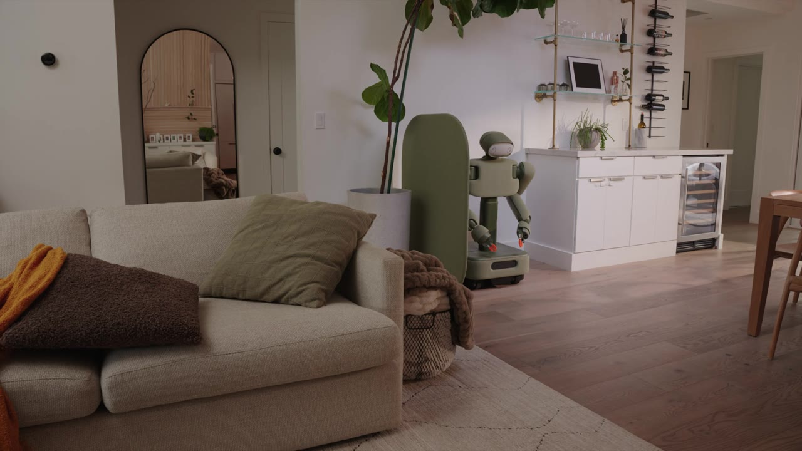
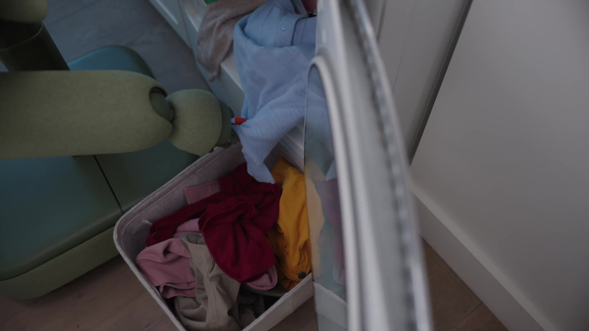
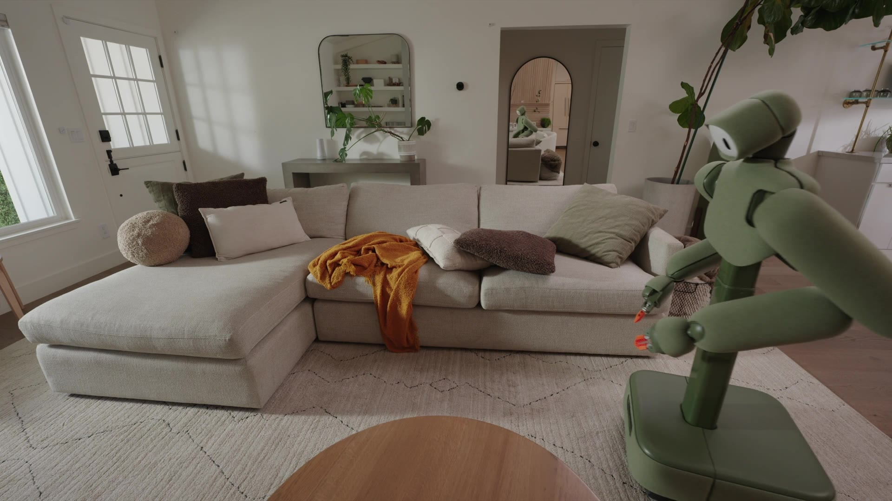
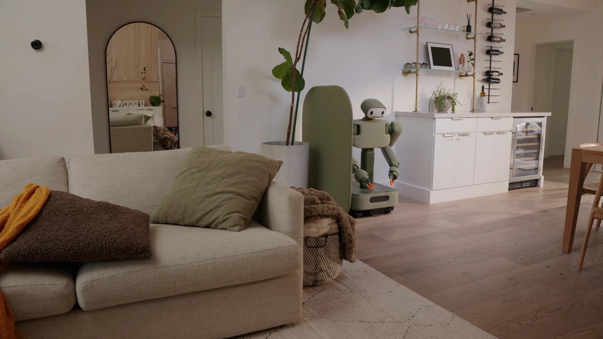

# Weave Robotics — Isaac 1 家用轮式机器人调研

> **文档生成时间**: 2026-07-17
> **信息来源**: [Weave Robotics 官网](https://www.weaverobotics.com/), [RobotsBeat](https://robotsbeat.com/), [DesignBoom](https://www.designboom.com/), [New Atlas](https://newatlas.com/), [Business Insider](https://www.businessinsider.com/)
> **公司性质**: Y Combinator 孵化，家用服务机器人

---

## 1. 公司概况

Weave Robotics 是一家总部位于旧金山的机器人公司，获得 **Y Combinator** 投资，专注于家用机器人。公司于 2026 年初推出第一代产品 **Isaac 0**（固定式衣物折叠机器人），随后在 2026 年 7 月发布第二代产品 **Isaac 1**——一款带轮子的移动家用机器人。

> **关键定位**：Weave 选择了一条有别于大多数人形机器人公司的路线——**非人形、轮式、专精家务**。其设计哲学是在降低成本和复杂度的前提下，优先解决单一场景中的真实问题。

### 核心事实

| 维度 | 数据 |
|------|------|
| **总部** | 美国旧金山 |
| **孵化** | Y Combinator |
| **首款产品** | Isaac 0（2026 年初，固定式折叠机器人） |
| **二代产品** | Isaac 1（2026 年 7 月发布，移动式） |
| **发货时间** | 2026 年秋季（加州首批），2027 年全美 |
| **定价** | $7,999 一次性购买 / $449/月订阅 |
| **设计原则** | 轮式（非双腿）、织物外壳、可伸缩躯干、物理隐私设计 |

---

## 2. Isaac 1 产品设计理念

### 2.1 设计哲学：做减法，聚焦核心场景

Isaac 1 的设计体现了鲜明的实用主义路线：

- **轮式而非双足**：避免腿式机器人高昂的成本和机械复杂度
- **夹爪而非五指灵巧手**：简单可靠的橙色夹爪，而非复杂的五指灵巧手
- **织物软壳而非金属外壳**：可拆卸织物外壳（Sage、Gray、Slate Blue、Terracotta、Vesper 五色），融入家居环境
- **物理隐私设计**：头部摄像头配有物理遮板，明确指示机器人何时工作

这种"做得更少、做得更好"的理念，使其在人形机器人扎堆的赛道中走出差异化路线。

*图 1 — 在家庭环境中的 Isaac 1，配备织物外壳和高度可调躯干*

### 2.2 与竞争对手对比

| 维度 | Weave Isaac 1 | 1X NEO | Tesla Optimus | Figure 03 |
|------|--------------|--------|---------------|-----------|
| **形态** | 轮式（非人形） | 双足人形 | 双足人形 | 双足人形 |
| **价格** | **$8,000** | ~$20,000 | 未公布（估>$15K） | 未公布（估>$20K） |
| **灵巧手** | 简单夹爪 | 20-DoF 肌腱驱动 | 22-DoF | 12-DoF |
| **场景** | 家务（洗衣/整理） | 家用全场景 | 工厂→家用 | 工厂物流 |
| **自主性** | 自主+遥操作备份 | 自主+遥操作备份 | 全自主 | 全自主 |
| **发售** | 2026 秋 | 2026 底 | 2027+ | 2026 |

### 2.3 产品图片

*图 2 — Isaac 1 执行衣物折叠任务*

*图 3 — Isaac 1 进行 Daily Reset 任务（整理房间）*

*图 4 — Isaac 1 Sage 配色方案（共 5 色）*

---

## 3. 技术规格

### 3.1 硬件规格

| 规格 | 参数 |
|------|------|
| **尺寸（宽×深）** | 20.5" × 22"（520mm × 559mm） |
| **高度范围** | 3' - 5'9"（0.91m - 1.75m）可伸缩 |
| **垂直伸展** | 80"（2.03m） |
| **水平伸展** | 38"（0.97m） |
| **自由度** | 21 DoF（2 颈部 + 2×6 臂 + 2×1 手 + 2 躯干 + 3 底盘） |
| **电池续航** | 8 小时 |
| **充电时间** | 2 小时 |
| **连接** | Wi-Fi |
| **材质** | 内部金属结构 + 可拆卸织物外壳 |
| **移动方式** | 轮式底盘（被动稳定） |
| **安全性** | 被动安全织物、物理摄像头遮板 |

### 3.2 软件与 AI 系统

Isaac 1 的软件系统采用混合架构：

- **自主导航**：基于视觉的室内导航和避障
- **任务规划**：端到端任务执行（Laundry Flow / Daily Reset）
- **遥操作备份**：当机器人遇到无法处理的场景时，远程人类操作员可以接管
- **App 控制**：通过智能手机应用调度任务（即时或定时）
- **OTA 更新**：通过固件更新持续增加新功能

### 3.3 系统架构图

*图 5 — Weave Robotics Isaac 1 系统架构概览*

---

## 4. 能力范围

### 4.1 Laundry Flow（洗衣流程）

Isaac 1 的核心能力之一，覆盖洗衣全周期的多个环节：

1. **寻找和拾取脏衣物**：在家中找到散落的脏衣服并收集
2. **处理装满的洗衣篮**：移动和搬运洗衣篮
3. **折叠衣物**：继承自 Isaac 0 的核心能力，Isaac 0 已**每周折叠超 1,000 磅衣物**
4. **收纳干净衣物**：将折叠好的衣物放回相应位置

> 图片来源：Weave Robotics 官网，Isaac 0 已在实际家庭环境中累计运行超过 **2,000 小时**

### 4.2 Daily Reset（日常整理）

第二个核心能力包，面向日常家居整理：

- **整理床铺**
- **整平枕头和毯子**
- **将玩具、鞋子、杂物放回原位**

### 4.3 扩展能力

Weave 表示随着 OTA 更新，Isaac 1 的能力将持续扩展。可能的扩展方向包括从洗衣机/烘干机装卸衣物等。

---

## 5. 商业模式与商业化

### 5.1 定价策略

| 方案 | 价格 | 说明 |
|------|------|------|
| **一次性购买** | **$7,999** | 全额购买 |
| **月订阅** | **$449/月** | 含服务 |
| **预约金** | $250（可全额退款） | 排队预留位 |

**定价策略分析**：$8,000 的定价显著低于同类竞品（1X NEO 约 $20,000），体现了 Weave 做减法策略的核心优势。通过轮式底盘 + 简单夹爪，大幅降低了 BOM 成本。

### 5.2 发货计划

| 阶段 | 时间 | 区域 |
|------|------|------|
| 首批发货 | 2026 年秋季 | 加州优先 |
| 全美扩展 | 2027 年 | 美国全境 |
| 国际市场 | 未公布 | - |

### 5.3 遥操作商业模式

Isaac 1 的一个关键设计特征是**不承诺完全自主**。Weave 明确表示默认自主运行，但在必要时由远程人类操作员介入。这一模式：

- **确保任务完成率**：而非追求纯自主指标
- **持续数据收集**：每次遥操作介入都为系统提供了训练数据
- **降低技术门槛**：使得当前 AI 能力即可交付有用产品

---

## 6. 技术路线与行业意义

### 6.1 非人形路线的价值

在人形机器人成为主流的 2026 年，Weave 的轮式路线提供了重要的对比案例：

- **成本优势**：$8K vs $15K–$100K 人形竞品
- **稳定性**：轮式底盘天生稳定，无需复杂的平衡控制
- **能效**：轮式移动能耗远低于双足行走
- **安全性**：无腿部机构，无摔倒风险

### 6.2 局限性

- **无法爬楼梯**：限制了在多层住宅的使用
- **场景受限**：目前仅支持洗衣和整理两个场景
- **依赖遥操作**：自主性不完全，规模化复制需减少人力介入
- **先加州后全美**：初期地理覆盖有限
- **隐私顾虑**：摄像头在家中的持续运行带来天然担忧

### 6.3 行业意义

Isaac 1 代表了具身智能领域的一条重要分支——**"够用就好"路线**。在人形机器人追求通用性、高复杂度操作的同时，Weave 选择了"轮式 + 简单夹爪 + 遥操作备份"的实用方案。其核心意义在于：

1. **价格降维打击**：$8K 的价格使家用机器人从"富裕玩具"变为"高消费品"
2. **遥操作模式验证**：人机协作方案可能比纯自主更快实现商业闭环
3. **分阶段自主路径**：用有人辅助的产品收集真实数据，逐步减少人工介入
4. **精细设计价值**：织物外壳、色彩选择、物理隐私设计等消费品思维

---

## 7. 竞争格局

Isaac 1 面临的竞争格局：

| 竞争对手 | 产品 | 形态 | 价格 | 对比优势 |
|---------|------|------|------|---------|
| **1X Technologies** | NEO | 双足人形 | ~$20,000 | 通用场景更广 |
| **Tesla** | Optimus | 双足人形 | 未公布 | 品牌 + 量产能力 |
| **Figure AI** | Figure 03 | 双足人形 | 未公布 | 工业场景成熟 |
| **Agility Robotics** | Digit | 双足物流 | ~$250K+ | 物流场景已验证 |
| **赛果** | - | - | - | **Isaac 1 以 1/2–1/10 价格覆盖家用场景** |

---

## 8. 附录

### 8.1 关键信息来源

| 来源 | 内容 | 链接 |
|------|------|------|
| 官网 Isaac 1 页 | 产品详情、规格、FAQ | https://www.weaverobotics.com/isaac-1 |
| RobotsBeat 报道 | 产品发布详情分析 | https://robotsbeat.com/ |
| DesignBoom | 设计哲学与审美分析 | https://www.designboom.com/ |
| New Atlas | 技术规格对比 | https://newatlas.com/robotics/weave-robot-isaac1-laundry-bed/ |
| Business Insider | 商业影响分析 | https://www.businessinsider.com/ |
| RoboHorizon | 行业定位与战略分析 | https://robohorizon.com/ |

### 8.2 术语表

| 术语 | 说明 |
|------|------|
| **遥操作 (Teleoperation)** | 远程人类操作员通过摄像头接管机器人控制 |
| **VLA (Vision-Language-Action)** | 视觉-语言-动作模型 |
| **OTA (Over-The-Air)** | 无线固件更新 |
| **DoF (Degrees of Freedom)** | 自由度，衡量机器人灵活性的核心指标 |
| **BOM (Bill of Materials)** | 物料清单，决定产品硬件成本 |

---

*本文档基于公开信息整理，仅供学习交流使用。产品规格以 Weave Robotics 官方发布为准。*
